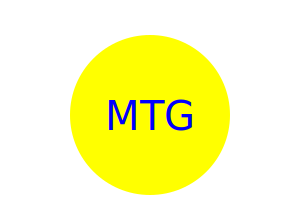

  # Simple Logo Generator (SVG)

  ## Description

  A Node.js application that outputs a simple logo based on user input. Supports square, triangle, and circle shapes. Includes input for 3 text characters, and text/shape color

  Link to video showcasing application usage:

  https://drive.google.com/file/d/1RezODSgvvgI0fnVy1W-HMzTZdGHuHkMk/view

  ## Table of Contents
  * [Installation](#installation)
  * [Usage](#usage)
  * [Contributions](#contributions)
  * [Tests](#tests)
  * [License](#license)
  * [Contact](#contact)
  * [Examples](#examples)

  
  ## Installation

  Utilizes Node.js, Jest for testing, Inquirer for prompts

  ## Usage

  Run "node index" in "simple-logo-generator" directory in terminal

  ## Contributions

  Only repository owner can contribute at this time

  ## Tests

  Run "npm test" in "tests" directory in terminal

  ## Examples

  
  
  

  ## License

  MIT License

  ## Contact

  Any questions or comments can be directed to: mgerlach0130@gmail.com or www.github.com/Gerlach0130

